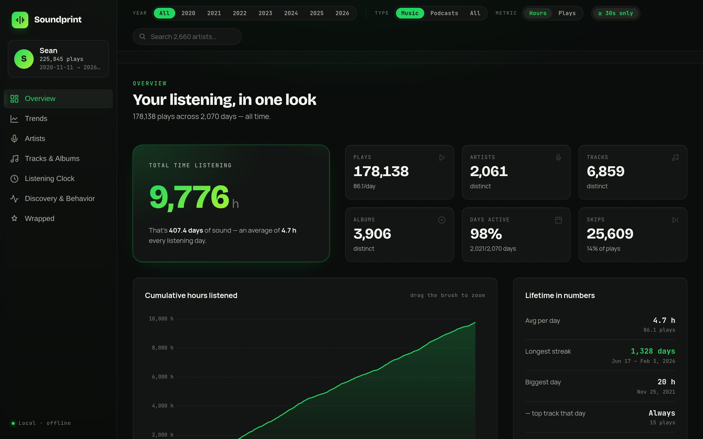
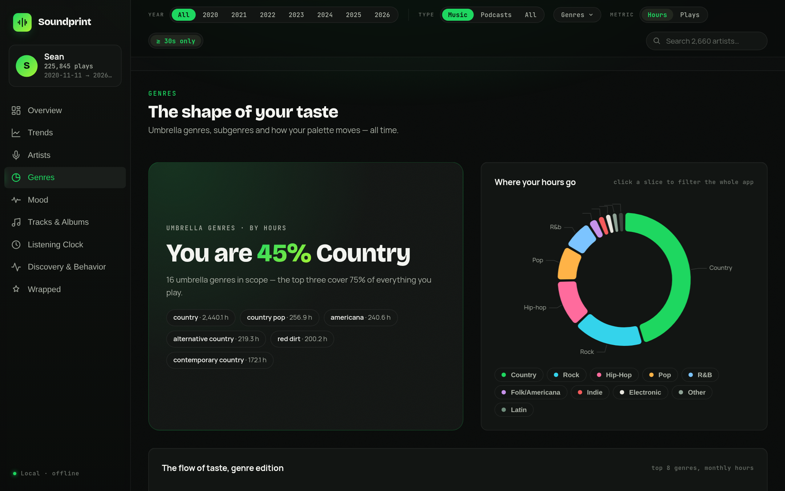
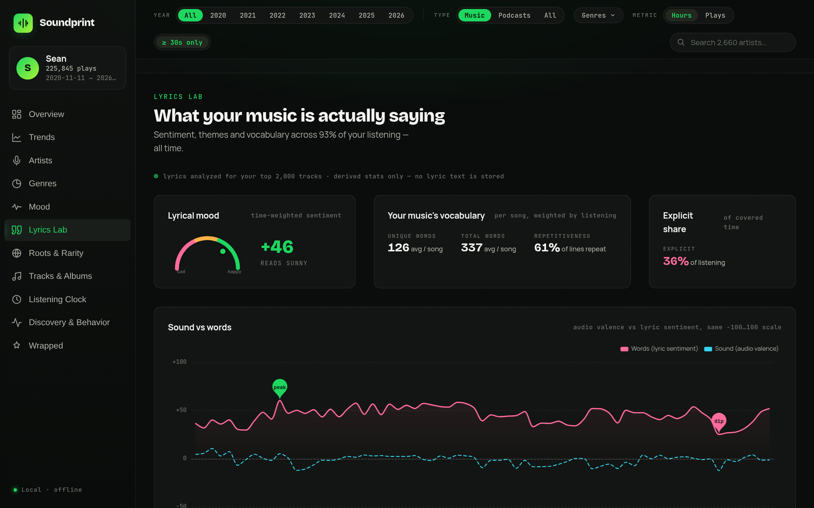
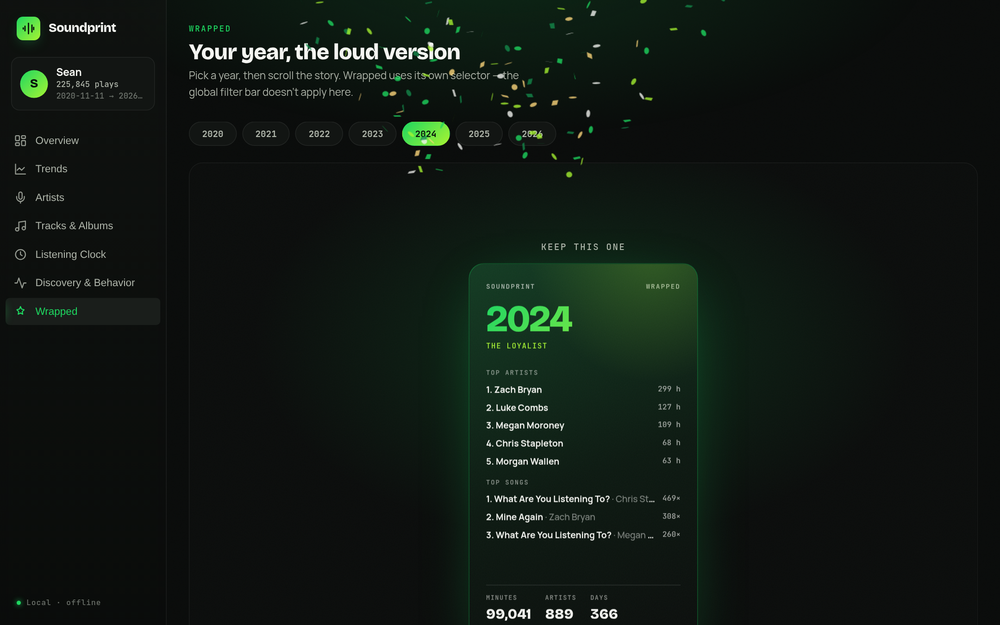

# Soundprint — a better Spotify dashboard

Turn your **Spotify Extended Streaming History** into a single, self-contained,
interactive HTML dashboard — eleven sections of charts covering everything from
your all-time listening to genre, mood, lyrics, listening clock, and a scrollable
Wrapped. One file. No server. No account. Works fully offline.



Spotify hands you a pile of JSON. Soundprint turns it into the year-in-review you
wish you got every month — then enriches it with genres, audio features, release
years, artist origins and lyric analysis pulled from open music databases, so you
can see the *shape* of your taste, not just the totals.

---

## What it is

- **One command in, one HTML file out.** Point `soundprint.py` at your export zip
  and it produces `soundprint.html` — a ~4 MB file with your entire dataset
  compressed and embedded inside it. Double-click to open.
- **Everything is client-side.** The dashboard decompresses its own data in the
  browser and re-aggregates on every filter change. No network calls, no tracking.
- **Enriched, not just counted.** Optional enrichment adds genres, mood/audio
  features, release years, artist origins and lyric-derived stats from six free
  public data sources.
- **Built for real histories.** Handles hundreds of thousands of plays; year
  subsetting keeps huge or decades-long libraries fast.

The example screenshots and coverage numbers throughout this README come from a
real 225,845-play library spanning Nov 2020 → Jul 2026.

---

## The eleven sections

| Section | What you get |
|---|---|
| **Overview** | Total hours, plays, distinct artists/tracks/albums, days active, skips; cumulative-hours curve with a zoom brush; lifetime records (longest streak, biggest day). |
| **Trends** | Per-year calendar heatmaps, monthly hours + plays, year-over-year comparison, rolling 30-day momentum, streaks, seasonal profile. |
| **Artists** | Top-25 leaderboard, rank-bump chart, taste streamgraph, discovery timeline, loyalty & depth, rising vs. fading, one-hit wonders. |
| **Genres** ✦ | Umbrella-genre share, genre streamgraph and bump chart, season/daypart heatmaps, discovery timeline, diversity trend, subgenre treemap. |
| **Mood** ✦ | Audio-DNA radar, valence/energy mood quadrant, valence over time, mood by hour & weekday, tempo histogram, acousticness trend, per-year fingerprints. |
| **Lyrics Lab** ✦ | Lyric sentiment vs. audio valence, vocabulary richness, repetitiveness, explicit share, theme flags, distinctive words — all derived stats, **no lyric text is stored**. |
| **Roots & Rarity** ✦ | Where your artists come from (country/city), how old the music you play is, mainstream-vs-obscure popularity, and era detection. |
| **Tracks & Albums** | Top-25 tracks, on-repeat binges, track lifespans, never-skip vs. most-skipped, completion histogram, top albums, podcast corner. |
| **Listening Clock** | Hour × weekday matrix, radial 24-hour clock, weekday vs. weekend, night-owl panel, hourly personality, session analysis. |
| **Discovery & Behavior** | Skip anatomy, start/end reasons, shuffle behavior, platform evolution, countries & travel, diversity index. |
| **Wrapped** | A scroll-snap, per-year story: top artists & tracks, biggest day, listening personality, a shareable poster, confetti finale. |

✦ = powered by enrichment. With `--skip-enrich` these four sections degrade
gracefully (they show a friendly "enrichment unavailable" state) and everything
else works exactly as normal.

<p align="center">
  
  
</p>

---

## Quickstart

### 1. Get your Extended Streaming History from Spotify

This is **not** the small "Account data" download — you want the *Extended*
history, which has every play back to the beginning.

1. Go to **[spotify.com/account/privacy](https://www.spotify.com/account/privacy/)**.
2. Under *Download your data*, tick **"Extended streaming history"** (untick the
   others if you like).
3. Request it and confirm via the email Spotify sends.
4. **Wait.** Spotify can take **up to ~30 days** to prepare it (often it's a few
   days). You'll get an email with a `my_spotify_data.zip`.

Inside the zip is a `Spotify Extended Streaming History/` folder full of
`Streaming_History_Audio_*.json` files. That's what Soundprint reads.

### 2. Install and build

```bash
git clone https://github.com/SeanSalvador2/a-better-spotify-dashboard
cd a-better-spotify-dashboard
python -m pip install -r requirements.txt      # one small dependency (lyric sentiment)

python soundprint.py ~/Downloads/my_spotify_data.zip
```

Open the resulting `build/soundprint.html` in any modern browser. Done.

> Requires **Python 3.9+**. Node.js is only needed for the optional test suite,
> not for building.

---

## Usage

```
python soundprint.py my_spotify_data.zip [options]

  --out DIR           output/work directory (default: ./build)
  --skip-enrich       skip API enrichment; build fast without genre/mood/lyrics pages
  --years 2019-2023   only include plays from these years (a single year works too)
  --tz America/New_York   timezone for local-wall-clock timestamps
  --top-lyrics N      analyze lyrics for your top-N tracks by listening time (default 2000)
  --top-itunes N      look up release years for your top-N tracks via iTunes (default 1200)
  --keep-going        if one enrichment source errors, continue with what was gathered
```

Examples:

```bash
# Fast dashboard, no enrichment (a minute or two)
python soundprint.py my_spotify_data.zip --skip-enrich

# Only the last few years, into a custom folder
python soundprint.py my_spotify_data.zip --years 2021-2024 --out ./mine

# Go deep on lyrics and release years
python soundprint.py my_spotify_data.zip --top-lyrics 4000 --top-itunes 2500
```

You can also pass an already-unzipped folder instead of a zip.

---

## Enrichment sources

Spotify's export contains no genres, no audio features and no release years, so
Soundprint fills them in from six free, public, no-key data sources. Every lookup
is matched carefully (normalized names, same-name disambiguation) and **cached on
disk**, so an interrupted run resumes and re-runs only fetch what's new.

| Source | Adds | Keyed by | Example coverage* |
|---|---|---|---|
| **Wikidata** | Artist genres, origin country, formation/birth year | Artist name (SPARQL, batched) | genres 99.6%, country 93.2%, year 92.8% |
| **Deezer** | Coarse genre bucket + popularity (fan count) | Artist name | popularity 99.7% |
| **ReccoBeats** | Audio features (energy, valence, danceability, tempo, acousticness…) | Spotify track ID | 79.6% direct, 97.8% incl. artist-mean backfill |
| **iTunes Search** | Release year (most accurate) | Artist + title | release year 94.9%† |
| **LRCLIB** | Lyric-derived stats: sentiment, themes, vocabulary, explicit flag | Artist + title | lyrics 92.7%† |
| **MusicBrainz** | City-level artist origin | Artist name (disambiguated) | origin city 65.6% |

<sub>* Time-weighted coverage from the 225,845-play example library — i.e. the
share of your actual *listening time* that got enriched, which runs much higher
than a raw per-artist rate because your most-played artists match most reliably.
† Release-year and lyric coverage are over the top-N tracks by listening time.</sub>

All figures are printed for your own library at the end of an enrichment run.

---

## Privacy

Soundprint is built to keep your data yours.

- **Everything stays local.** The dashboard is a single offline file; opening it
  makes zero network requests. Your listening history is never uploaded anywhere.
- **IP addresses are stripped.** Spotify includes a coarse IP with every play;
  `build_dataset.py` drops it entirely and never writes it out.
- **Raw lyrics are never stored.** The lyrics step fetches lyric text transiently
  to compute derived statistics (sentiment score, word counts, theme flags), keeps
  the raw text only in a local scratch cache, and writes **only numbers and short
  keywords** to the dashboard. A build-time check enforces that no string longer
  than 60 characters can leak into the output.
- **The only network traffic is enrichment.** During a build, the enrichment steps
  send artist names and track titles to the six public APIs above to look up
  metadata. Run with `--skip-enrich` for a build that touches the network only to
  fetch the GSAP animation library (see [VENDOR_LICENSES.md](VENDOR_LICENSES.md)).
- **Your export never enters the repo.** `.gitignore` excludes raw data, caches
  and all generated datasets by default.

---

## Runtime expectations

- **`--skip-enrich`:** roughly **1–3 minutes** — mostly just parsing your JSON and
  assembling the HTML.
- **Full enrichment (first run):** **minutes to a few hours**, dominated by the
  iTunes step, which is rate-limited to ~20 requests/minute. A ~2,600-artist /
  ~8,600-track library takes on the order of an hour end-to-end.
- **Re-runs:** near-instant for anything already cached. The caches live under
  your `--out` directory, so a second build (e.g. after `--top-lyrics` bump) only
  fetches the delta.

The build prints live progress for every step and is safe to Ctrl-C and resume.

### Long or huge histories

Got 15 years of data, or a library so large the full build drags? Use `--years`
to subset before building:

```bash
python soundprint.py my_spotify_data.zip --years 2020-2024
```

The dashboard's year chips, all aggregates, and enrichment are computed over just
that window, keeping things fast and focused.

---

## How it works

```
your_export.zip
      │  unzip
      ▼
Streaming_History_*.json ──► pipeline/build_dataset.py ──► dataset.json(.gz)
                                    │  (per-play columnar, dictionary-encoded,
                                    │   local-time baked in, IPs dropped)
                                    ▼
                             enrich/idmap.py            (id-space bridge)
                                    │
        ┌───────────────────────────┼───────────────────────────┐
        ▼            ▼               ▼             ▼              ▼
   Wikidata      Deezer        ReccoBeats      iTunes /       MusicBrainz
   (genres)   (genre+pop)   (audio features)   LRCLIB          (origin)
        └───────────────────────────┼───────────────────────────┘
                                     ▼
                       enrich/build_enrichment.py ──► enrichment.json(.gz)
                                     │
                                     ▼
                             site/build.py  ──►  soundprint.html
              (inlines CSS, fonts, JS, vendor libs, and the gzip+base64
               dataset into one fully self-contained offline file)
```

The dataset is stored per-play (not pre-aggregated) so the browser can re-slice it
live on every filter change. It's delta-encoded and dictionary-encoded for gzip,
then base64-embedded and decompressed in-browser via `DecompressionStream`.

---

## Repository structure

```
.
├── soundprint.py            # one-command orchestrator CLI
├── requirements.txt
├── pipeline/
│   ├── build_dataset.py     # raw export -> compact per-play dataset.json
│   └── verify.mjs           # round-trip integrity check
├── enrich/
│   ├── idmap.py             # bridges dataset indices <-> raw export
│   ├── run_wikidata.py  run_deezer.py  run_reccobeats.py
│   ├── run_itunes.py    run_lrclib.py  run_musicbrainz.py  run_release.py
│   ├── build_enrichment.py # merges all sources into enrichment.json
│   ├── common.py  genremap.py
│   ├── genre_umbrella_map.json  theme_lexicons.json
│   └── verify_enrichment.mjs
├── site/
│   ├── build.py             # inlines everything into one soundprint.html
│   ├── src/                 # dashboard source (core, charts, 11 sections, styles)
│   └── vendor/              # ECharts, CountUp, confetti, fonts (GSAP fetched on build)
├── docs/                    # design brief, build spec, data spec, enrichment research
├── assets/                  # README screenshots
├── LICENSE                  # MIT
└── VENDOR_LICENSES.md       # third-party library licenses
```



---

## Credits

- **Data enrichment** thanks to the open communities behind
  [Wikidata](https://www.wikidata.org/), [MusicBrainz](https://musicbrainz.org/),
  [Deezer](https://developers.deezer.com/api),
  [ReccoBeats](https://reccobeats.com/), [LRCLIB](https://lrclib.net/) and the
  [iTunes Search API](https://developer.apple.com/library/archive/documentation/AudioVideo/Conceptual/iTuneSearchAPI/).
- **Front-end** built on [Apache ECharts](https://echarts.apache.org/),
  [GSAP](https://gsap.com/), [CountUp.js](https://github.com/inorganik/countUp.js)
  and [canvas-confetti](https://github.com/catdad/canvas-confetti); typeset in
  Bricolage Grotesque, Manrope and JetBrains Mono. See
  [VENDOR_LICENSES.md](VENDOR_LICENSES.md).
- Soundprint is not affiliated with, endorsed by, or sponsored by Spotify. Spotify
  is a trademark of Spotify AB.

Licensed under the [MIT License](LICENSE).
